# How to use the Study Framework to setup your own factorial study in Unreal

## Prepare Project
* First of all get the StudyFramework as Plugin into you project, e.g., using the setup script of the [RWTH VR Project Template](https://devhub.vr.rwth-aachen.de/VR-Group/unreal-development/unrealprojecttemplate), this plugin also requires the following plugins:
  * [``RWTH VR Toolkit``](https://devhub.vr.rwth-aachen.de/VR-Group/unreal-development/plugins/rwth-vr-toolkit)
  * [``Universal Logging``](https://devhub.vr.rwth-aachen.de/VR-Group/unreal-development/plugins/universallogging)
* Set game instance (``Settings -> Project Settings -> Maps&Modes``) to ``SFGameInstance``
* Set game mode (``Settings -> Project Settings -> Maps&Modes``) Set to ``SFGameMode``
* Potentially set the mouse to not be captured to use the UI (``Settings --> Project Settings --> Input --> Default Viewport Mouse Capture Mode = No Capture``), **should however not be necessary when using the latest ``RWTH VR Toolkit`` version.**
* To use packages builds, e.g., CAVE, tick ``Settings --> Project Settings -> Packaging --> Cook everything in the project content directory``

## Setup Phases and Factors etc.
* This framework requires a Setup map (e.g., simply the Main level) which is started and contains a study setup, but is not part of the study itself. Add a SFStudySetup (``StudyFrameworkPlugin C++ Classes -> StudyFrameworkPlugin -> Public -> SFStudySetup``) actor to this level. In the properties section of this actor we can set up the study.  Whenever a property of the StudySetup is changed, this change will automatically be saved to a JSON file, by default "StudySetup.json" located in the ```[ProjectDir]/StudyFramework``` folder. You can switch between different setup files, using the ```Select Setup File```-function. Note: Setup files have to be located on the same drive as the project folder.\
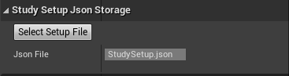
* Add independent variables. Optionally, these can be automatically asked at the beginning of a study run for each participant by checking (1), where the question/prompt is defined by (2) and in case of a multiple choice question the answer buttons are defined by (3).
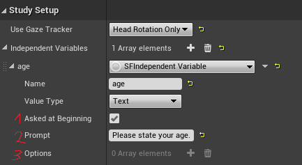
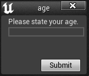
* Add phases to this setup\
 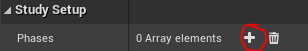\
and select ``SFStudyPhase`` instead of ``None`` (phases can be used if some blocks of the study should always come in the same order, e.g., always start with a warm-up phase or always end with a nice end scene), at least one phase needs to be present!
* Open the phase's details (1) and give it a recognizable name, then add a factor (2)\
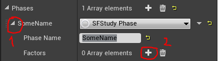\
Factors define the different conditions you want to examine, e.g., in a 2x2 factorial design you have two factors with two levels each giving 4 conditions in total to examine. There are currently two kinds of factors to chose from:
  * ``SFMapFactor`` specifying which map/maps to use. Exactly one map factor has to be present per phase with at least one map.\
For MapFactors you do not specify the factor's ``Levels`` directly but pick levels/maps/worlds for ``Maps``, which then passes it on to the Levels entry internaly *(only available since version v1.1)*.
  * ``SFStudyFactor`` to specify any other factor you want to examine, giving all the levels as ``FString``, which you then can access during running the study by ``USFGameInstance::Get()->GetFactorLevel(FactorName)``
  * Condition orders etc. can be randomized, see the [randomization](Randomization) page
* Add dependent variables to the phase(1)\
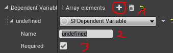\
Dependent variables represent whatever you want to measure in each nondition (combination of levels for al factors). They should have a unique name (2). Furthermore they can be specified as required (3), which means that a condition cannot be finished without having collected data for that variable. 
  * Whenever you have gathered information for that variable, pass it on to the system with
    * ``USFGameInstance::Get()->LogData(DependentVarName, Value)`` or
    * ``USFLoggingBPLibrary::LogData(DependentVariableName, Value)`` (easier to call within a blueprint) 
    * which only take FString for values, so you have to convert it yourself. These are then logged and stored by the system. 
    * Calling these function multiple times for the same variable in the same condition will overwrite the value stored before.
  * If you want to store multiple results in one condition, e.g., because there are multiple trials, use ``USFMultipleTrialDependentVariable`` *(only available since version v1.1)*
    * For these you should define ``SubVariableNames`` since you want to potentially store multiple values together for one trial (for example: question, response and response time)
    * You should use ``LogTrialData(DependentVarName, Values)`` where ``Values`` is a ``TArray<FString>`` with one entry per ``SubVariable``
    * The data to these is not stored in the ``Phase_[...].csv`` file but in a separate file ``Phase_[...]_[DependentVariableName].csv``
    * In the Condition List only the number of recorded trial is shown but not the data itself for better overview
* This is the required study setup, but there are some more options there to explore.
* 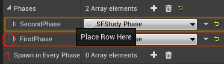\
If you want to reorder phases just pull them (1) to another location, since new phases can only be added at the end. (Additionally, you can also rearrange them in the json file while the Editor is closed, it will be reloaded on startup)

## Further Setup Options
* You can specify independet varaibles that can be asked for at the startup or that can be updated during execution (via ``USFParticipant``) if needed.
* There are some options with regard to fading between conditions:\
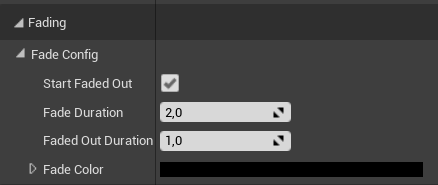
* There are also some options for configuring the experimenter view (HUD) and potentially showing it on a second window/screen when running experiments in desktop mode:\
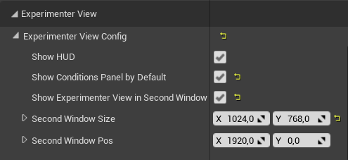


# How to execute a study

* Start the main/setup map
* If the last study run wasn't finished (all conditions with required dependent variables were successfully finished) you get different option to proceed:\
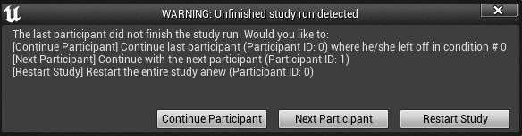\
Choose what is appropriate. This is especially helpful if something crashed and you want to continue the study run of a participant
* If you use the same environment for the study you degugged it in, click:\
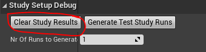\
so that all data generated during debug runs is removed and the study startes with participant ID 0.
* Click ``Start Study`` or call ``USFGameInstance::Get()->StartStudy()``.
* In general ``USFGameInstance::Get()`` is your central interface to the study framework, so checkout the docu/comment in SFGameInstance.h under ``Control Study``.
* Proceed through your conditions by clicking the next button or even better automatically calling ``USFGameInstance::Get()->NextCondition()``
* By clicking ``Show conditions`` you can see what conditions are planned. Green are those already finished and blue is the current one.
* Checkout what is logged and where: on the [logging](Logging) Wiki page, this is especially needed when recording data for the dependent variables.

# How to debug your study

* You can start study maps directly (for debugging) once you have started on the setup map once and the system picks the first condition for the last participant that is situated on the map you started to choose the appropriate factor levels etc. *(in that process the map is "started" twice, because it first sets up everything and then "fades" over to the map again, so everything looks as in the real study execution)*
* You can create a bunch of study runs for different participant IDs, to check whether the setup works as expected, use this section in the StudySetup actor: \
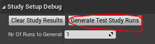\
  * Put in the number of runs to generate and click the button
  * You can find the ``Participant_[i].json`` files at ``StudyFramework/StudyRuns`` 
  * It also creates a ``GeneratedDebugRuns.txt`` file there which helps to inspect multiple runs as concise as possible.
  * You can exlude factors which you don't want to show up in the ``GeneratedDebugRuns.txt`` file by adding their names to ``ExcludeFactorsFromGeneratedRunsTable``. This is only meant to increase readability of the ``GeneratedDebugRuns.txt`` file and will change nothing else.