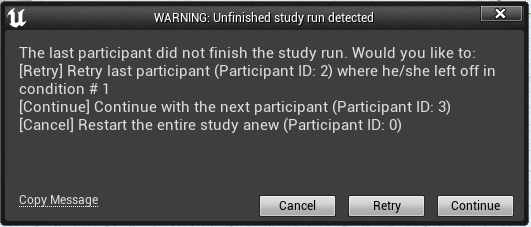

# How to use the Study Framework to setup your own factorial study in Unreal

* First of all get the StudyFramework as Plugin into you project, e.g., using the setup script of the [RWTH VR Project Template](https://devhub.vr.rwth-aachen.de/VR-Group/unreal-development/unrealprojecttemplate), this plugin also requires the following plugins:
  * [``RWTH VR Toolkit``](https://devhub.vr.rwth-aachen.de/VR-Group/unreal-development/plugins/rwth-vr-toolkit)
  * [``Universal Logging``](https://devhub.vr.rwth-aachen.de/VR-Group/unreal-development/plugins/universallogging)
* This framework requires a Setup map (e.g., simply the Main level) which is started and contains a study setup, but is not part of the study itself. Add a SFStudySetup (``StudyFrameworkPlugin C++ Classes -> StudyFrameworkPlugin -> Public -> SFStudySetup``) actor to this level. In the properties section of this actor we can set up the study (which is also on saving the map stored in a json file, which chan be changed and is reloaded on editor start. Furthermore there are buttons to storing into and loading from a json file specified, which will be searches in ``ProjectDir/StudyFramework``).
* Add phases to this setup\
 \
and select ``SFStudyPhase`` instead of ``None`` (phases can be used if some blocks of the study should always come in the same order, e.g., always start with a warm-up phase or always end with a nice end scene), at least one phase needs to be present!
* Open the phase's details (1) and give it a recognizable name, then add a factor (2)\
\
Factors define the different conditions you want to examine, e.g., in a 2x2 factorial design you have two factors with two levels each giving 4 conditions in total to examine. There are currently two kinds of factors to chose from:
  * ``SFMapFactor`` specifying which map/maps to use. Exactly one map factor has to be present per phase with at least one level.\
The names for the levels/maps should be, e.g., ``/Game/Maps/Warmup`` if there is a ``Warmup`` map in a Maps folder in your Content folder.
  * ``SFStudyFactor`` to specify any other factor you want to examine, giving all the levels as ``FString``, which you then can access during running the study by ``USFGameInstance::Get()->GetFactorLevel(FactorName)``
  * Condition orders etc. can be randomized, see the [randomization](Randomization) page
* Add dependent variables to the phase(1)\
\
Dependent variables represent whatever you want to measure. They should have a unique name (2). Furthermore they can be specified as required (3), which means that a condition cannot be finished without having collected data for that variable. Whenever you have gathered information for that variable, pass it on to the system with ``USFGameInstance::Get()->LogData(DependenVariableName, Value)`` which only takes FString for values, so you have to convert it yourself. These are then logged and stored by the system.
* This is the required study setup, but there are some more options there to explore.
* Set game instance (``Settings -> Project Settings -> Maps&Modes``) to ``SFGameInstance``
* Set game mode (``Settings -> Project Settings -> Maps&Modes``) Set to ``SFGameMode``
* \
If you want to reorder phases just pull them (1) to another location, since new phases can only be added at the end. (Additionally, you can also rearrange them in the json file while the Editor is closed, it will be reloaded on startup)
* Potentially set the mouse to not be caputred to use the UI (Settings --> Project Settings --> Input --> Default Viewport Mouse Capture Mode = No Capture)

# How to execute a study

* Start the main/setup map
* If the last study run wasn't finished (all conditions with required dependent variables were successfully finished) you get different option to proceed:\
\
Choose what uis appropriate 
* Click ``Start Study`` or call ``USFGameInstance::Get()->StartStudy()``.
* In general ``USFGameInstance::Get()`` is your central interface to the study framework, so checkout the docu/comment in SFGameInstance.h under ``Control Study``.
* Proceed through your conditions by clicking the next button or even better automatically calling ``USFGameInstance::Get()->NextCondition()``
* By clicking ``Show conditions`` you can see what conditions are planned. Green are those already finished and blue is the current one.
* Checkout what is logged and were: on the [logging](Logging) Wiki page

# How to debug your study

* You can start study maps directly (for debugging) once you have started on the setup map once and the system picks the first condition for the last participant that is situated on the map you started to choose the appropriate factor levels etc.

