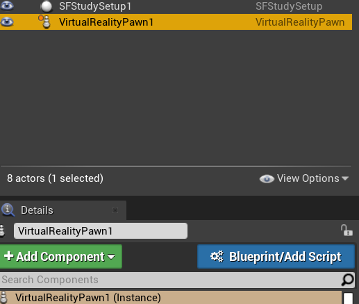
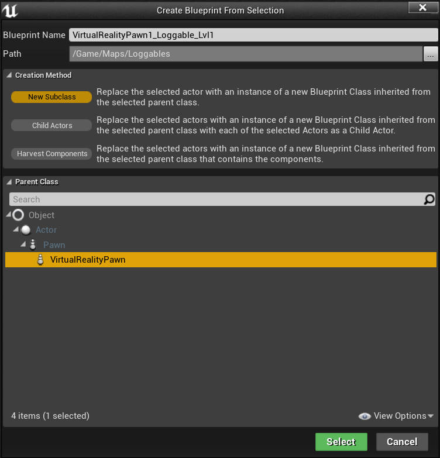
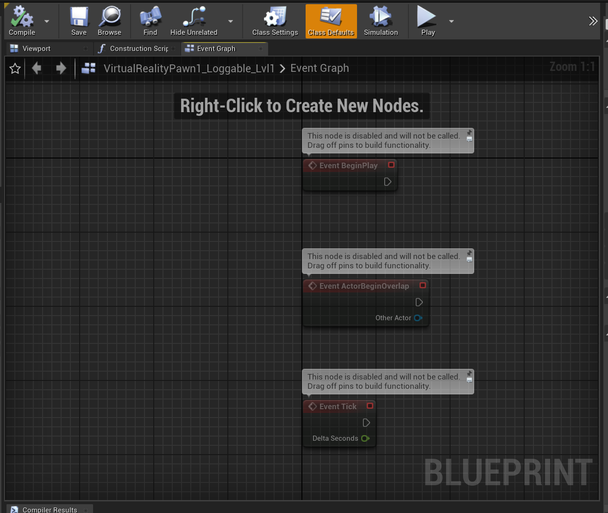
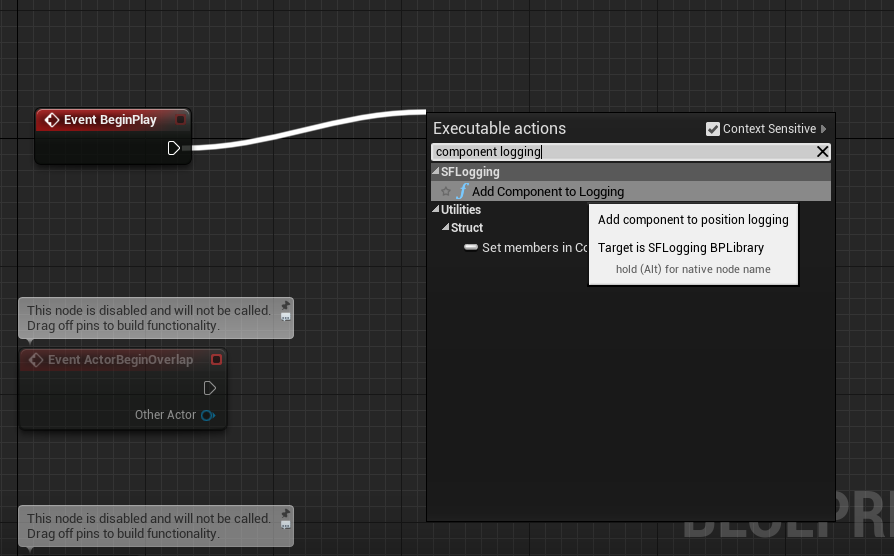
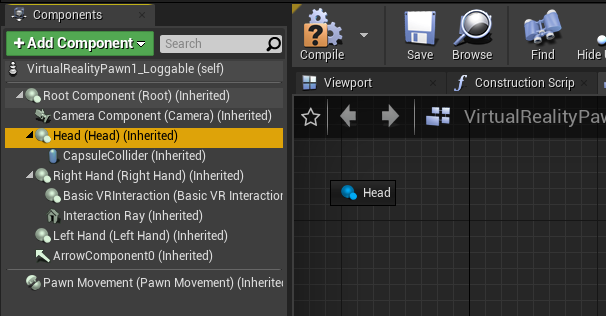
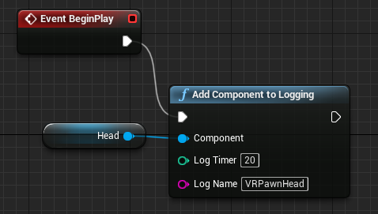
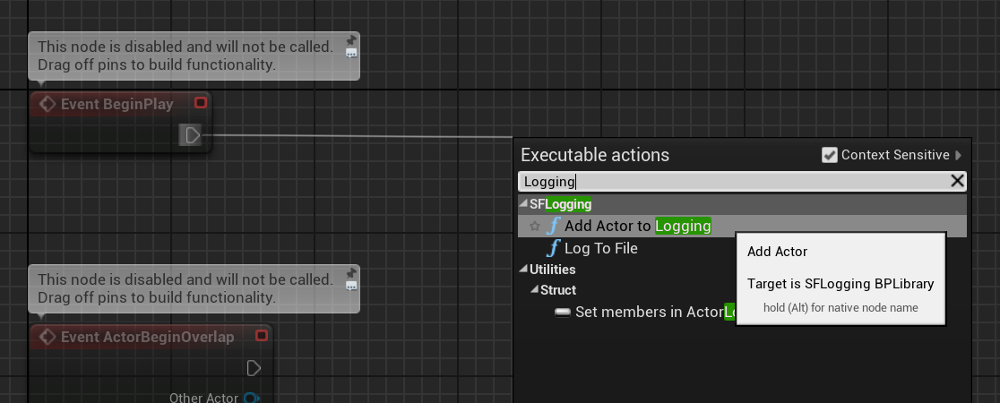
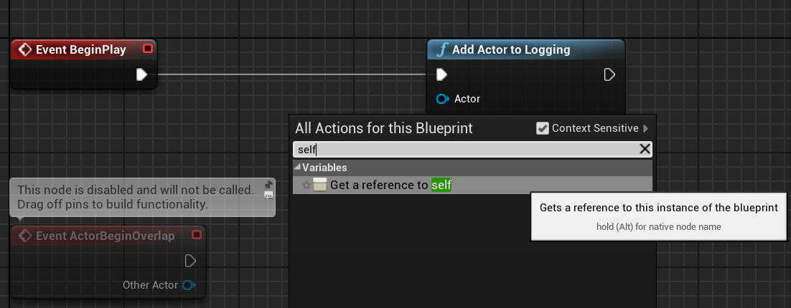
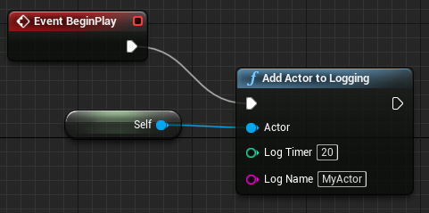

# What is logged and where:

* In `StudyFramework/StudyRuns/LastParticipant.txt` always the last participant that the study was executed and some information on that run is stored.
* In `StudyFramework/StudyRuns/Participant\_\[i\].txt` the conditions planned/executed for participant i are stored as json.
* In `StudyFramework/StudyLogs/ParticipantLogs/LogParticipant-\[i\]` comments (with a preceeding '#'), events (Start condition..) and reported dependent variable values are logged
* In `StudyFramework/StudyLogs/PositionLogs/PositionLogParticipant-\[i\]` the position & rotation info of tracked actors/components are logged
* In `StudyFramework/StudyLogs/Phase\_\[...\].csv` holds for each phase the data of all participants. This is in a format to easily use in statistics tool like `r`.
* In `StudyFramework/DebuggingLogs/SFLog.txt` all logs generated by the study framework in the last run of Unreal are gathered (mainly for debugging).

# Position Logging with the Study-Framework

## Getting Started

Currently, you can log the position and rotation of actors and components with a specified frequency. For that there are two settings:

- **LogName** is the name that will associated with the log, if left empty, the id name of the actor will be used
- **LogTimer** specifies the logging frequency in Miliseconds. So if set to 20, it will write a log 50 times per second. **Note:** The maximum frequency possible is the frame rate the game runs at. So if the frequency of the recorded values is lower than what you set it at, it is probably limited by the frame rate. If you want frame-by-frame position logging, simply enter `0`.

The information will be written out as tab-separated values into a file in the `StudyFramework/StudyLogs/PositionLogs/`-directory of your project. **Note:**

- When an actor/component is added to logging on one map, this will not automatically transfer to the other maps. If you want to track a component's / an actor's movements in all maps, you have to add them to logging in each map (see "Tip" below).
- The logging is only active when a condition is active (namely **not** while fading in / fading out), even though the player can still be moved during the fading process. The length of the fade can be adapted in the StudySetup object settings ([see HowToUse - Further Setup Options](/HowToUse#further-setup-options)).

### Example: Logging the Position of the Player in VR

The player position is a bit of a special case, as the movement of the HMD only affects the Head component of the `VirtualRealityPawn` actor that is controlled by the player. So to log the player position we need to add the Head component of the `VirtualRealityPawn` actor to logging. To do that, we first have to open the level/map, in which we want to log the position: `File -> Open Level`. If the `VirtualRealityPawn` actor does not a have a Blueprint associated with it, we have to create one like this:

#### Creating a new Blueprint for an Actor

1. Select the Actor and click on `Blueprint/Add Script` in the `Details` tab\
   
2. We are be prompted with the window seen below. Name and path to where it is saved are not relevant. Example settings are filled in below (I created the folder `Loggables` for the actors I want to log). On a technical level, your actor will be replaced with a copy of your actor (an instance of a new subclass to be precise), that behaves in exactly the same way, with the same settings, but it now additionally has all the features defined in the new Blueprint.\
   

Now we can edit the Blueprint.

> **Tip:** If we use this actor in multiple levels, we can reuse this loggable version in all of those levels. Simply replace the actor with the new "loggable"-actor. The settings specified in the blueprint will then affect the instances of that actor in all levels. If we want to use different logging settings per actor in different levels, we have to create a new blueprint per level.

#### Using the Blueprint to add VRPawn Head-Component to Logging

- In the `Blueprint Editor` window, open the `Event Graph` 
- From the `Event BeginPlay` node draw a line from the white arrow to add a new node. Select the `Add Component to Logging` node. 
- Then drag&drop the Head Component into the graph. 
- Finally, connect the nodes as seen below. You can adjust the `Log Name` and `Log Timer` within the node. 
- Save and compile the Blueprint when you are done

## Other Position Logging Functionality

- You can **log the position of any component** in the same way as shown above with the VRPawn Head-Component.
- You can also **log the position of actors**:
  - From the `Event BeginPlay` node draw a line from the white arrow to add a new node. Select the `Add Actor to Logging` node. 
  - Right-click on the background and place a `Get a reference to self` node 
  - Finally, connect the nodes as seen below. You can adjust the `Log Name` and `Log Timer` within the node. 
  - Save and compile the Blueprint when you are done
- **Note:** Logging the position of an actor is equivalent to logging the position of their `Root`-component. The `Add Actor to Logging`-function is syntactic sugar.