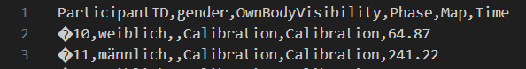

**Here is a collection of problems that might occur and how to potentially solve them. Please add new insights ;-)**

* On one of my maps the study experimentor overlay is not shown:
> Maybe the map overwrites the gamemode, open the ``World Settings`` on that map an check:<br>
    <br>
     This should be ``None``
<br>
<br>

* There are weird characters in my csv Phase log files, e.g.:<br>

<blockquote>
Unreal produces byte order marks (BOM) for some reaseon (for possible solutions see #93), you can place and execute the following python code in the folder (``StudyFramework/StudyLogs``) where the phase csv files are:


```python
import os

def ConvertCoding(full_filename):
    #remove all the byte order marks that Unreal puts in there
    with open(full_filename, mode='r', encoding='utf-8-sig') as file:
        lines = file.readlines()
        modified_lines = [line.lstrip('\ufeff') for line in lines]
    with open(full_filename, mode='w', encoding='utf-8') as file:
        file.writelines(modified_lines)

for filename in os.listdir("./"):
    if filename.endswith(".csv"): 
        print("Convert " + filename)
        ConvertCoding(filename)

```
</blockquote>
<br>
<br>

* I lost some data in the phase data tables due to whatever reasons during study execution.
> If you lost data because of selecting "Restart Study" or accidentally restarted a condition, for which data has already been collected, see below. If you lost data another way: Fortunately everything is logged redundantely also per participant, so you data can most probably be recovered. Here is a script that, when placed in the ``StudyFramework`` folder should do the trick. Maybe you need to adapt parts, since it was developed and tested for one specific study setup. SO CHECK YOUR DATA CAREFULLY! [ReconstructPhaseTablesFromParticipantLogs.py](uploads/a97f6c3b8caebd3c21b9ae6c903a6314/ReconstructPhaseTablesFromParticipantLogs.py)

* I accidentally restarted the study or restarted a condition
> Whenever a condition or the entire study is restarted, a backup of the changed/deleted files can be found under `StudyFramework/StudyLogs/RecyclingBin`. To recover the files, stop running the study, then choose the appropriate timestamps, copy/paste the files from the recycling bin back into the `StudyFramework/StudyLogs`-folder, replacing the edited files, if necessary. You can then start the study again.