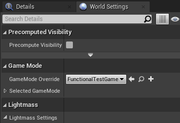

**Here is a collection of problems that might occur and how to potentially solve them. Please add new insights ;-)**

* On one of my maps the study experimentor overlay is not shown:
> Maybe the map overwrites the gamemode, open the ``World Settings`` on that map an check: 
     
     This should be ``None``